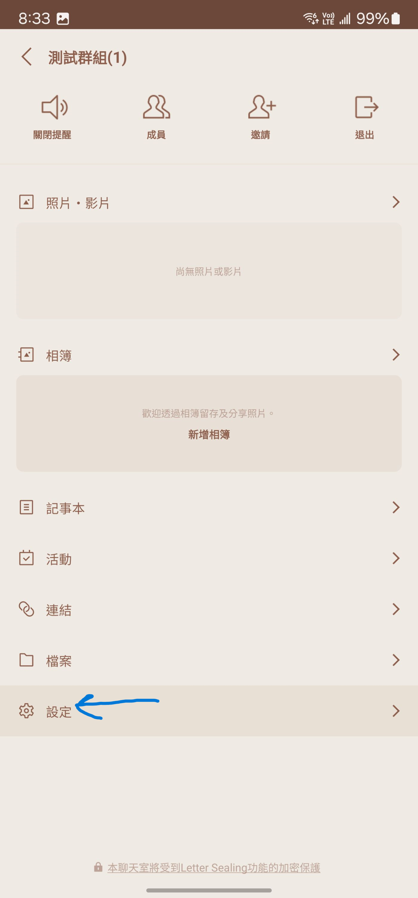

# GuessPrivacy_Use_LLM
## [點我下載編譯好的檔案](https://github.com/steveh8758/GuessPrivacy_Use_LLM/releases/download/v1.0/GuessPrivacy_Use_LLM_Release.zip)
## 使用方法
### 導出 Line 對話紀錄
==請不要改導出的文字檔名，因為程式是以`[LINE]`作為選取文檔的依據==
1. 
2. 
3. 
4. 將導出的 txt 們放到與 `ParseLineMessages.exe` 或 `ParseLineMessages.py` 的資料夾下
   預設 `ParseLineMessages.py` 文件在 `Parser` 資料夾內。
   
5. 執行 `ParseLineMessages.exe`
   

---

### LLM
1. 打開 `Promt.txt`。
2. 將內容複製到語言模型中輸入。
3. 將匯出的 `[LINE] 與xxx的x聊天_ooo.json` 檔案以文字文件打開，並且複製進模型中。
4. 複製完後，開始問問題。

---

## Result

